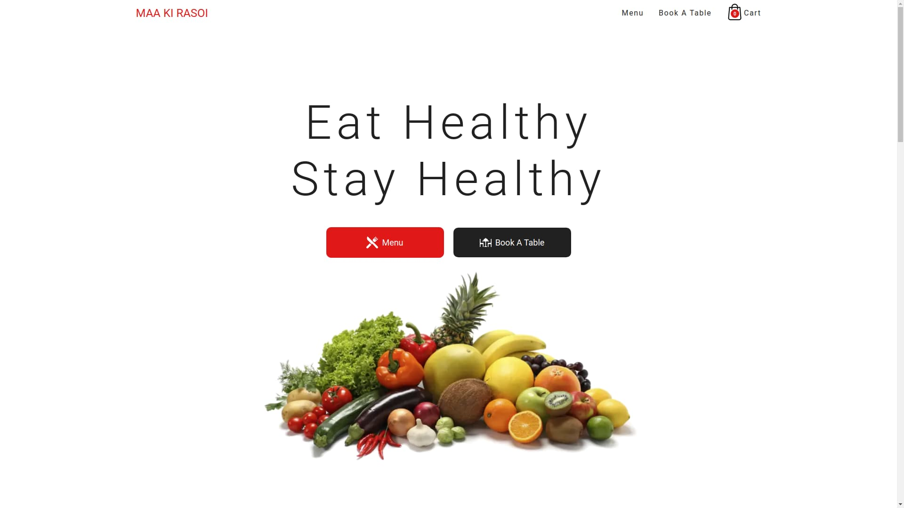
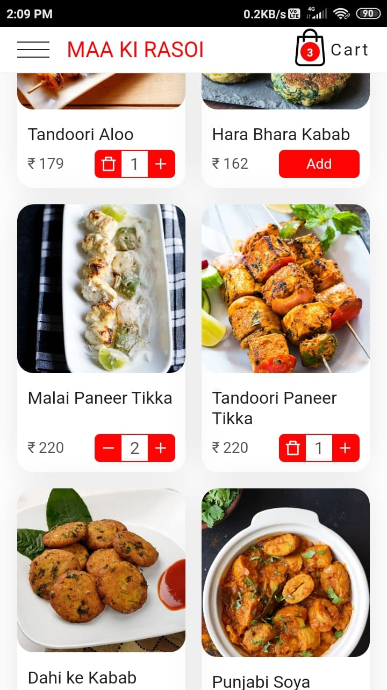

## Maa Ki Rasoi
A simple restaurant web app using React. Don't expect that you will get anything on your doorstep 😜️. I created this project to practice my React magic 😎️.

View Live Here: [maa-ki-rasoi.netlify.app](https://maa-ki-rasoi.netlify.app/)

 
## Screenshots

  
  

## Technology used
- [React](https://reactjs.org/)
- [SASS](https://sass-lang.com/)

